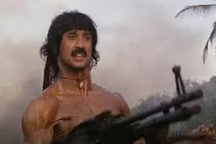

# ¿En que consiste el trabajo?
**Este trabajo se basa en la pelicula RamboIII**
## Resumen 
Algunos años después del incidente de Vietnam, <strong>Rambo</strong>  vive lejos de su vida como soldado reparando un templo budista y donando a sus monjes las ganancias que obtenía en la lucha de palos en Bangkok, Tailandia.   <strong><abbr title="Richard Crenna">El Coronel Trautman</abbr></strong> junto al asesor militar <strong><abbr title="Kurtwood Smith"> Robert Griggs</abbr></strong> consiguen encontrarle para que los acompañe en la misión de suministrar cohetes y armas a los muyahidines afganos en su lucha contra el ejército soviético, pero se niega diciendo que su guerra había terminado.

---
 
- Películas
    - Rambo:Primera sangre
    - Rambo:Acorralado PTII
    - Rambo III
    - Rambo IV
    - Rambo La ultima misión

### Imágenes

---

### Actores y sus personajes

| Personajes      | Actores          |
|-----------------|------------------|
| John Rambo      |Sylvester Stallone|
| Coronel Trautman|Spiros Focás      |
|Mushaf Gani      |Kurtwood Smith    |
|Coronel Zaitsev  |Marc de jonge     |
|Robert Griggs    |Kurtwood Smtih    |
|Masoud           |Spiros Focás      |
|Hamid            |Doudi Shoua       |

- Temas
    - Historia
    - Saga
    - Reparto
    - Lugar de rodaje
    - Colaboraciones
    - Argumento

**Programas utilizados**
 - Visual Studio Core
 - Git
 - HTML 5
 - CSS3

 **Colores que voy a utilizar**
- Rojo
- Negro
- Blanco
-